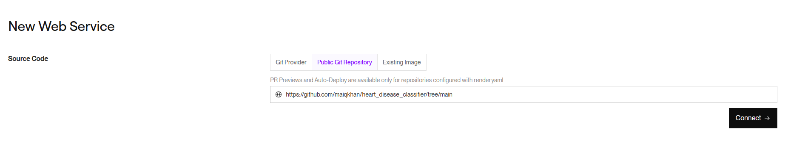
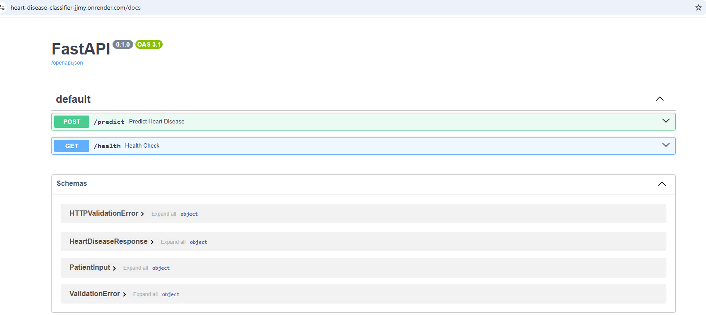

# Heart Disease Prediction - Machine Learning Application

## ⚠️ Disclaimer

This machine learning application is intended **for educational and learning purposes only**. It should **NOT** be used as a medical diagnostic tool or as a substitute for professional medical advice, diagnosis, or treatment.

**Important:**
- This project is a learning exercise in machine learning and data science
- The predictions made by this model are not clinically validated
- Always consult qualified healthcare professionals for medical advice
- Never make health decisions based solely on this application's output

If you have concerns about heart disease or any medical condition, please seek guidance from a licensed medical professional.

## Cloud Deployment
The Heart Disease Prediction service is deployed in the cloud and available for testing here: [heart-disease-classifier](https://heart-disease-classifier-jjmy.onrender.com/docs)

## Problem Statement

Heart disease remains one of the leading causes of death in Canada. Early detection and risk assessment are critical for prevention and timely intervention.

This project attempts to **predict the presence of heart disease using clinical measurements** through machine learning techniques. By analyzing patient demographics, vital signs, and cardiac test results, the goal is to build an accurate predictive model that can **provide interpretable insights** into which clinical factors are most strongly associated with heart disease, and predict heart disease proactively.

## Dataset Overview

The dataset is available in the repository here: [heart_disease_dataset](https://github.com/maiqkhan/heart_disease_classifier/blob/main/data/raw/heart_disease_data.csv)

The dataset contains **918 patient records** with 11 clinical features and 1 target variable:

**Clinical Features:**
- Age
- Sex
- Chest Pain Type (Typical Angina, Atypical Angina, Non-Anginal Pain, Asymptomatic)
- Resting Blood Pressure
- Cholesterol levels
- Fasting Blood Sugar (> 120 mg/dl)
- Resting ECG results
- Maximum Heart Rate achieved
- Exercise-Induced Angina
- ST Depression (Oldpeak)
- ST Slope

**Target Variable:**
- Heart Disease (0 = Normal, 1 = Heart Disease)


## Project Goals

- Build and evaluate multiple ML models (Logistic Regression, Random Forest, XGBoost)
- Produce a model that achieves high recall (minimizing false negatives)
- Provide feature importance analysis to understand key risk factors
- Deploy the model as a API service for clinical use

## Exploratory Data Analysis (EDA)

Exploratory data analysis is available in the following notebooks:

- [01_data_understanding.ipynb](https://github.com/maiqkhan/heart_disease_classifier/blob/main/exploratory_data_analysis/01_data_understanding.ipynb)
- [02_target_variable_and_feature_importance.ipynb](https://github.com/maiqkhan/heart_disease_classifier/blob/main/exploratory_data_analysis/02_target_variable_and_feature_importance.ipynb)

### EDA Summary
- HeartDisease has a balanced distribution of positive/negative observations
- There are no missing values or Nulls in the dataset
- The most important features in relation to heart disease are:
    - Maximum Heart Rate
    - OldPeak
    - ChestPainType
    - ST_Slope

## Model Training

3 models were trained:
1. Penalized Logistic Regression Model
2. Random Forest Model
3. XGBoost Classifier Model

Each model had its hyperparameters tuned via **GridSearchCV** with stratified 5-fold cross-validation, using recall as the objective metric (recall is used to maximize true positives, individuals with heart disease). Below are the recall scores for each model:

| Model 1 | Training Recall | Validation Recall | Test Recall |
| --- | :---: | :---: | :---: |
| Logistic Regression  | 0.956 | 1.0 | 0.907
| Random Forest  | 0.936 | 0.962 | 0.879
| XGBoost Classifier  | 0.919 | 0.972 | 0.889

The full grid search results are located here: [hyperparameter_tuning.ipynb](https://github.com/maiqkhan/heart_disease_classifier/blob/main/training/hyperparameter_tuning.ipynb)

[`training\train.py`](https://github.com/maiqkhan/heart_disease_classifier/blob/main/training/train.py) contains the grid search for only the Logistic Regression model as it had the best recall scores and will be served to end users via the API. To run the training scripts and notebooks, follow the deployment steps below.

## Deployment

### Dependencies

To setup the development environment:
1. Clone/Fork this repository: https://github.com/maiqkhan/heart_disease_classifier.git
2. Install UV through pip
```text
pip install uv
```
3. create virtual environment with the following command, which will also install all dependencies within the pyproject.toml:
```text
uv sync
```

### Training Model
1. run `training\train.py` with the following command:
```text
uv run training/train.py
```
The script will print out the recall scores and save a logistic regression model in the models folder.

### Deploying the Prediction Service - Local Container
To deploy the FastAPI prediction service in a docker container:
1. Build a docker image using the Dockerfile in the root of the repository:
```text
docker build -t heart-disease-classifier:latest .
```
2. Once the docker image is built, map port 9696 on the host, and deploy the container:
```text
docker run -it -p 9696:9696 heart-disease-classifier:latest
```
3. Once the container is running, in another terminal run `app\test.py` in uv to test the API:
```text
uv run app/test.py
```

A json object will be printed in the terminal, providing the heart disease indicator value
```json
{
    "heart_disease_indicator": 1
}
```


### Deploying the Prediction Service - Cloud Deployment

To deploy the prediction service in the cloud, many options can be used:
- AWS Elastic Beanstalk
- DigitalOcean
- Render

I used Render to deploy the web service which can be used at this link: [heart-disease-classifier](https://heart-disease-classifier-jjmy.onrender.com/docs)

To deploy the service in Render, follow these steps:
1. Create a Render account: [Render](https://dashboard.render.com/login)
2. Create a new Web Service using Public Git Repository to connect to this repository
   
4. Render will auto-detect the Dockerfile and prepare the environment to deploy the container in the cloud, Note:
    - Change the Region to whichever region is closest to you
    - Start with the Free plan, but note that it takes longer to load the service than paid plans. If you want fast response times, switch to a paid plan if you want.
   
5. Deploy the web service and follow the generated link to your cloud-deployed API. Currently, there is no front-end (html/css/javascript), but FastAPI comes with a "/docs" endpoint which can be used to test all endpoints:
   

